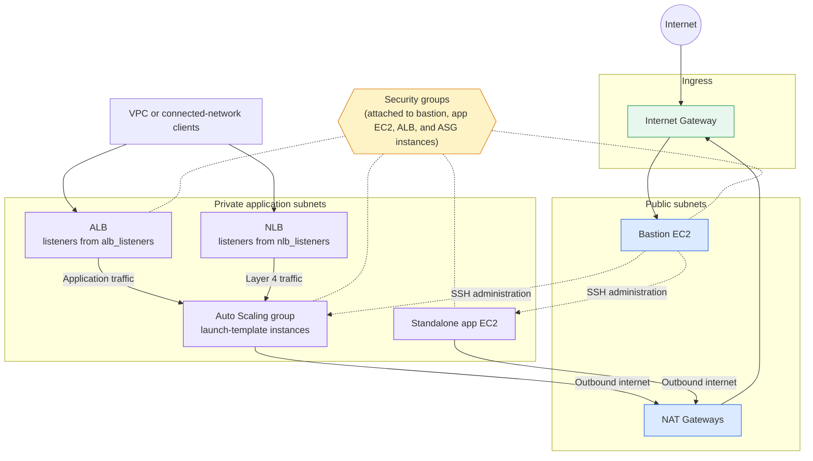
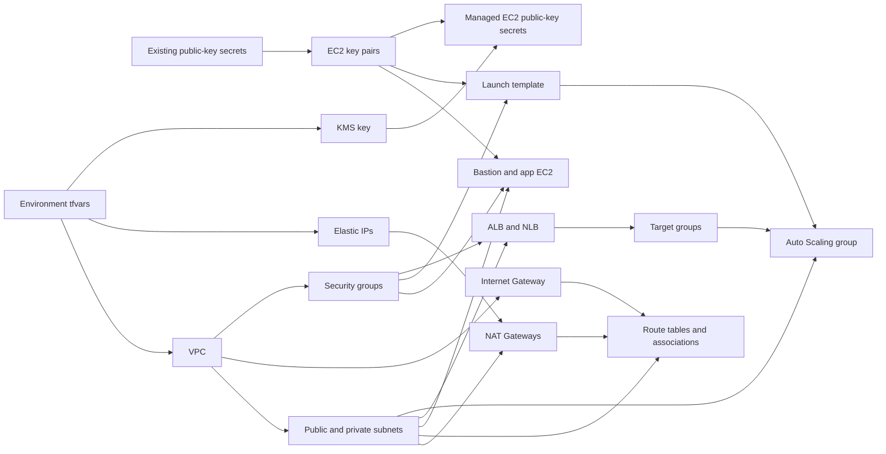

# ASG Fault-Tolerant EC2 Architecture

This implementation builds a VPC with public and private subnets, a bastion
host, a standalone application instance, and an Auto Scaling group (ASG) built
from a launch template. The ASG registers its instances with the target groups
of both an Application Load Balancer and a Network Load Balancer.

## Runtime traffic flow

Both load balancers are placed in private subnets. The NLB is internal unless
`nlb_enable_public` is `true`, and the ALB is public unless `alb_enable_public`
is `false`, so review those two settings together with the subnet choice. The
standalone app instance is not behind a load balancer. It is reached through
the bastion.

## Terraform dependency flow

Terraform uses the base modules under `modules/base/` for each component. The
public key for each key pair is read from an existing Secrets Manager secret
(`bastion_ec2_public_key_secret_name`, `app_ec2_public_key_secret_name`, and
`lt_ec2_public_key_secret_name`), which must exist before `plan`. The module
then writes the keys to new KMS-encrypted secrets named
`ec2/<name>/ec2-user/public-key`.

`locals.tf` hard-codes the two NLB subnet mappings (subnet names
`bc-subnet-rookie_app_private-dev-0` and `-1`, private IPs `10.0.0.100` and
`10.0.0.132`), so those subnets must exist in `private_subnets`. User data runs
only on first boot, and a new launch template version affects only instances
the ASG launches afterward.
