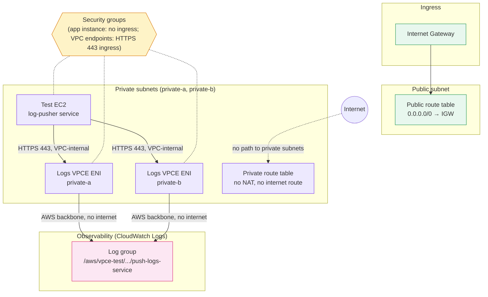
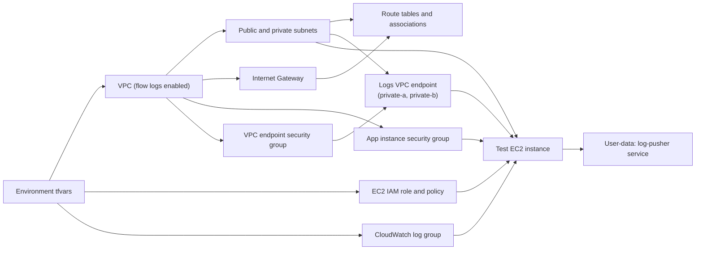

# CloudWatch VPC Endpoint Architecture

This implementation builds a VPC with flow logs enabled, a public subnet, and
two private subnets each fronted by a CloudWatch Logs interface VPC endpoint. A
private test EC2 instance pushes log entries to CloudWatch Logs entirely over
the AWS backbone, with no route to the internet.

## Runtime traffic flow

The private route table has no NAT gateway or internet route, so the test
instance can reach CloudWatch Logs only through the interface endpoints. VPC
flow logs are enabled on the VPC itself for network-level visibility.

## Terraform dependency flow

Terraform uses the base modules under `modules/base/` for each component. The
EC2 instance depends on the log group and IAM role so its user data can push to
CloudWatch Logs as soon as it boots, and on the VPC endpoint's subnets/security
group so the endpoint exists before the instance tries to reach it.
