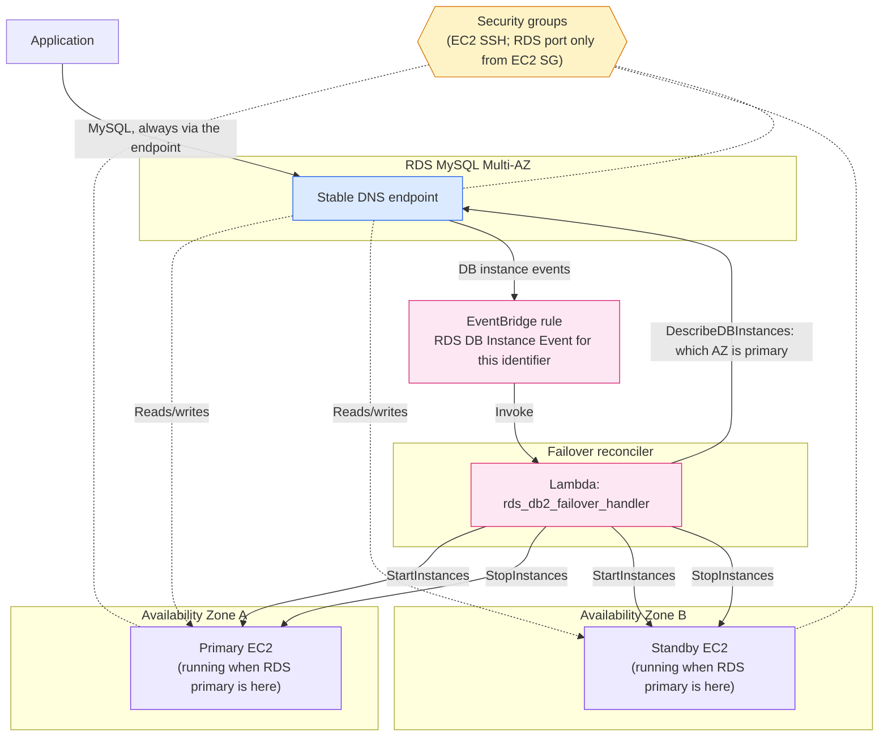
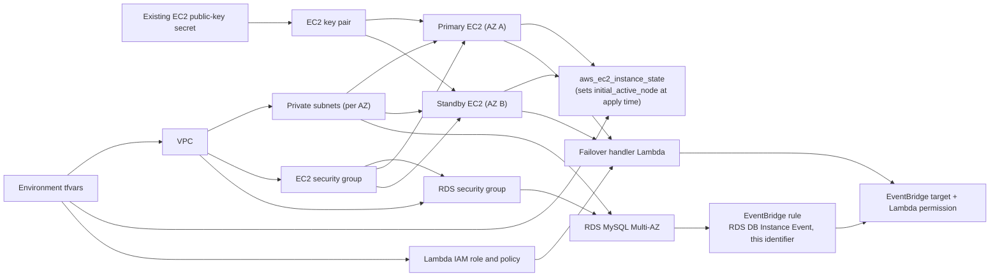

# Co-located EC2 and Multi-AZ MySQL Architecture

This implementation builds a VPC with one private subnet per Availability Zone,
a primary and a standby EC2 instance (one per AZ), and an RDS MySQL Multi-AZ
instance. A Lambda function keeps EC2 compute co-located with whichever AZ RDS
currently treats as primary: it starts the instance in that AZ and stops the
other one, triggered whenever RDS emits a DB instance event for this identifier.

EC2 instances cannot change Availability Zone in place, so this module
pre-creates one instance in each AZ and switches which one is running instead of
moving an instance. The RDS DNS endpoint stays stable across a failover, and
applications should always connect through that endpoint rather than to an
instance directly.

## Runtime traffic flow

The Lambda function only starts and stops instances; it never resizes storage
or changes which AZ the pair lives in. On `RDS-EVENT-0049` (failover started) it
polls `DescribeDBInstances` until the reported AZ and status settle before
acting, so it doesn't react to a DB instance that is mid-failover. There is no
scheduled poll — reconciliation only runs when RDS emits a matching event, plus
whatever you trigger manually (see Operations below).

## Terraform dependency flow

Terraform uses the base modules under `modules/base/` for the VPC, subnets,
security groups, key pair, EC2 instances, Lambda function, and RDS instance. The
`aws_ec2_instance_state` resources only set which instance is running the first
time you apply (`initial_active_node`); after that, the Lambda function is what
keeps the running instance matched to RDS's current primary AZ.

The secret referenced by `sm_ec2_ssh_public_key_name` must already contain an
OpenSSH public key. When `rds_mysql_manage_master_user_password` is `true`, RDS
stores its generated master password in Secrets Manager instead.