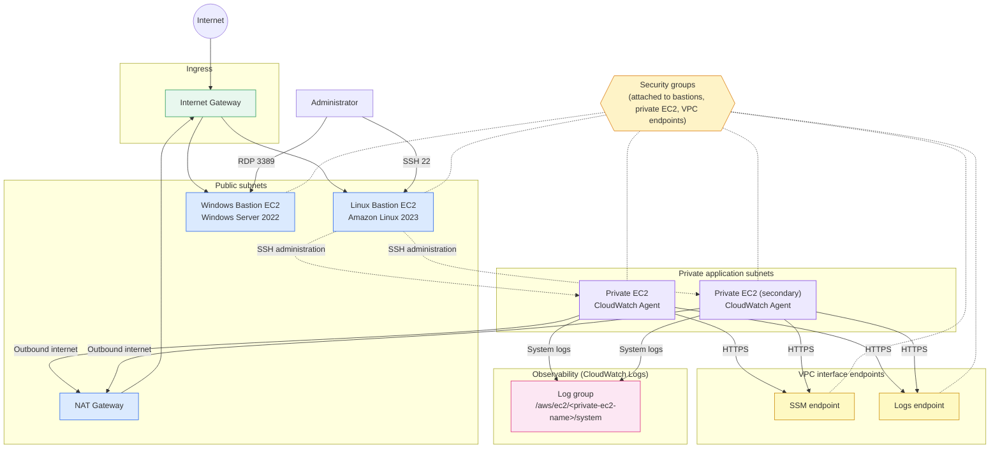
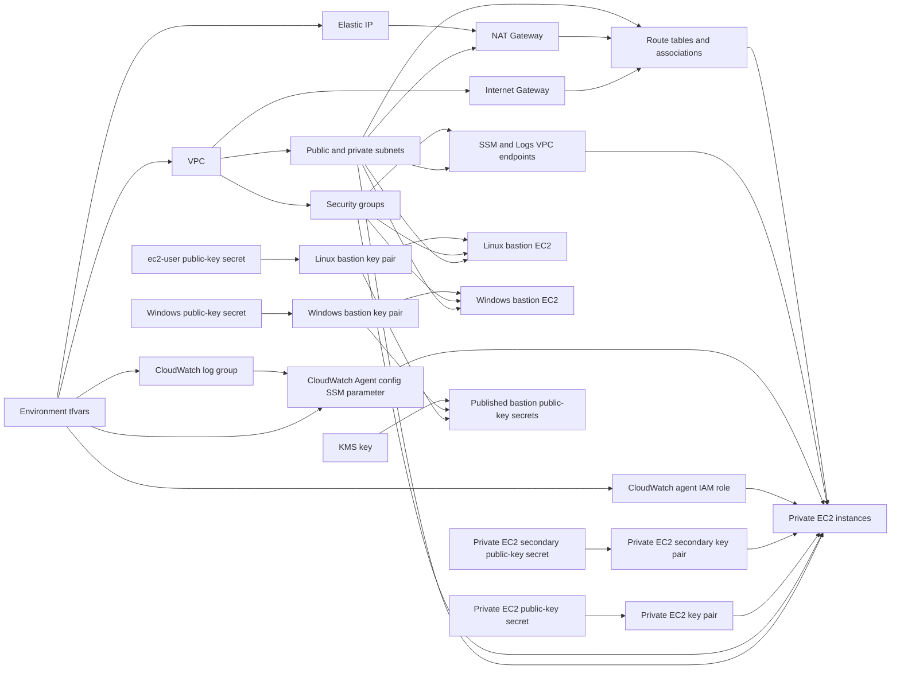

# Bastion + Private EC2 with CloudWatch Architecture

This implementation builds a VPC with public and private subnets, a Linux bastion,
a Windows bastion, and one or two private application instances reachable only
through the bastions or Systems Manager. Private EC2 instances run a CloudWatch
Agent that ships system logs to CloudWatch Logs, and reach SSM and CloudWatch
Logs over VPC interface endpoints instead of the internet.

## Runtime traffic flow

Private EC2 instances have no public IP; the bastions are the only supported
SSH/RDP path in from the internet. Windows AMIs reject ED25519 key pairs, so the
Windows bastion's key pair is sourced from its own RSA public-key secret while
the Linux bastion and private instances can share one ED25519 secret.

## Terraform dependency flow

Terraform uses the base modules under `modules/base/` for each component. Key
pairs are created from existing Secrets Manager public-key secrets rather than
local files, and the resulting bastion public keys are republished to Secrets
Manager, encrypted with a dedicated KMS key, for downstream consumers.
