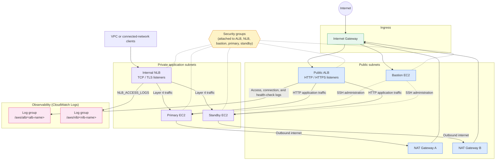
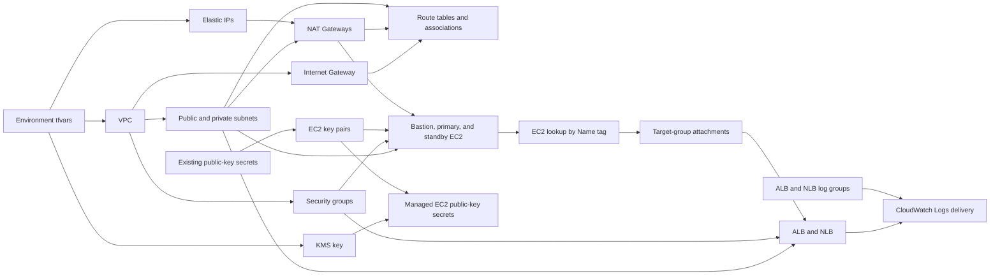

# EC2 HA Load-Balanced Architecture

This implementation builds a VPC with public and private subnets, two application
instances, a bastion host, and both Application and Network Load Balancers. The
load balancers distribute traffic to the primary and standby EC2 instances, and
their vended logs are delivered to CloudWatch Logs.

## Runtime traffic flow

The NLB is internal in the development configuration, so clients must reach it
from the VPC or a connected network. AWS emits NLB access-log records only for
TLS listeners; TCP listeners do not produce `NLB_ACCESS_LOGS` entries.

## Terraform dependency flow

Terraform uses the base modules under `modules/base/` for each component. The
explicit EC2 lookup converts the configured instance names to instance IDs before
building the ALB and NLB target-group attachments.
