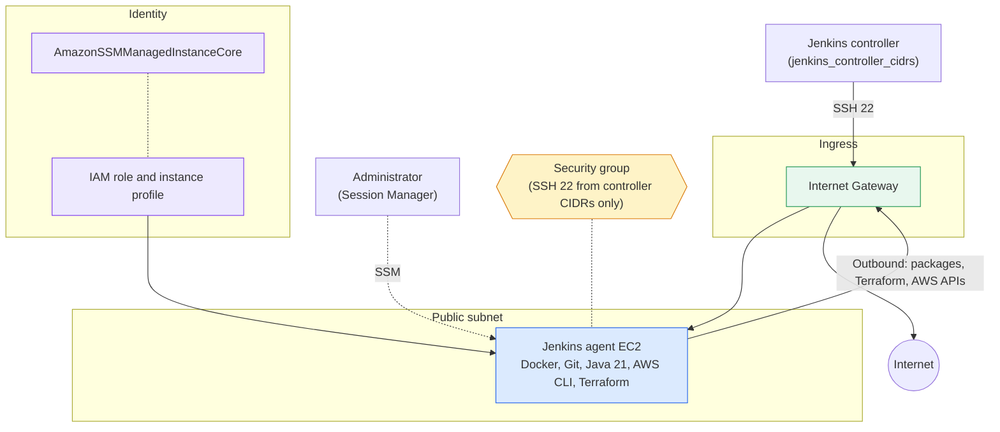
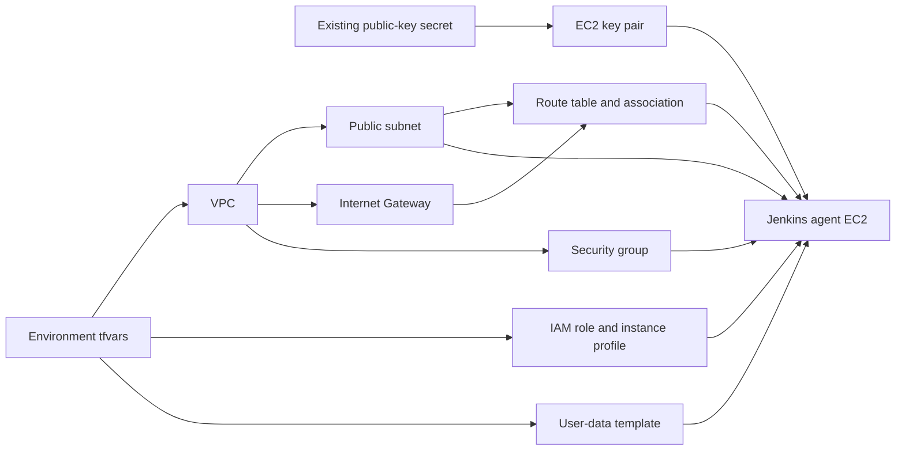

# Jenkins EC2 Agent Architecture

This implementation builds a dedicated VPC with one public subnet and a single
Jenkins build agent on EC2. The Jenkins controller connects to the agent over SSH
using a key pair created from a public key stored in AWS Secrets Manager. The
agent is bootstrapped with Docker, Git, Java, AWS CLI, and Terraform, and can be
administered through AWS Systems Manager.

## Runtime traffic flow

Inbound SSH is allowed only from `jenkins_controller_cidrs`; when the list is
empty no inbound rule is created and the agent is reachable only through Session
Manager. Outbound traffic is unrestricted so the agent can install packages and
call AWS APIs.

## Terraform dependency flow

Terraform uses the base modules under `modules/base/` for each component. The
agent waits for the route table association so the bootstrap script has internet
access on first boot. User data runs only on first boot; changing it does not
replace the instance unless `user_data_replace_on_change` is `true`.
