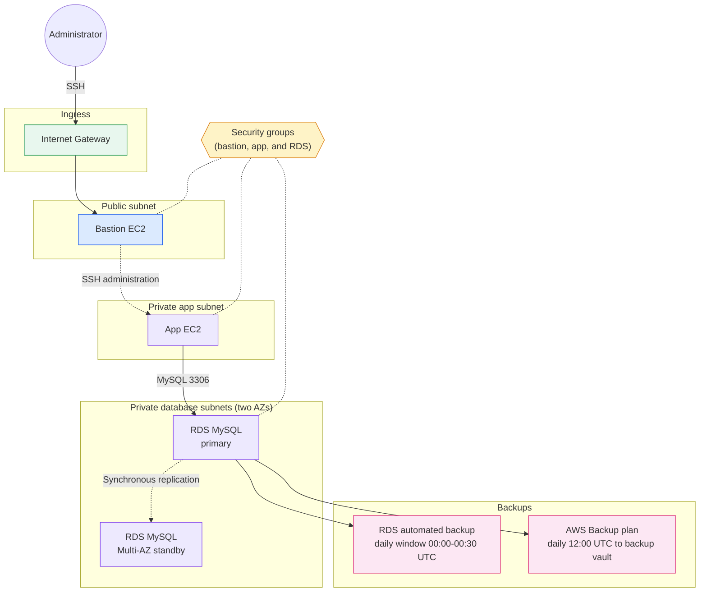
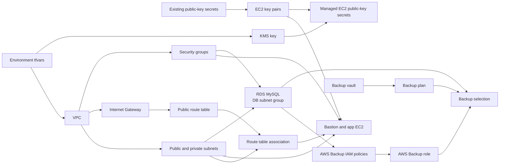

# EC2 with RDS MySQL and Dual Backup Architecture

This implementation builds a VPC with a public bastion subnet, a private app
subnet, and two private database subnets. It runs a bastion host, an app EC2
instance, and a Multi-AZ RDS MySQL instance. The database is protected by two
independent backups: RDS automated backups and an AWS Backup plan.

## Runtime traffic flow

The bastion is the only instance with a public IP, and its SSH ingress comes
from `bastion_ssh_ingress_cidrs`. The app security group accepts SSH only from
the bastion security group. The RDS security group accepts port 3306 from
`db_ingress_cidrs`, which is the whole VPC in the development configuration.
The RDS subnet group uses only the subnets in `db_subnet_names`, so the app
subnet is kept out of it. There is no NAT gateway, so the app instance has no
outbound internet access.

The first backup is the RDS built-in automated backup, kept for
`automated_backup_retention_days` inside `automated_backup_window`. The second
is an AWS Backup plan that runs on `aws_backup_schedule_expression`, stores
recovery points in its own vault, and keeps them for `aws_backup_retention_days`.
The plan is created only when `create_aws_backup` is `true`.

## Terraform dependency flow

Terraform uses the base modules under `modules/base/` for each component. The
public key for each EC2 key pair is read from an existing Secrets Manager secret
(`bastion_ec2_public_key_secret_name` and `app_ec2_public_key_secret_name`),
which must exist before `plan`. The module then writes the keys to new
KMS-encrypted secrets named `ec2/<name>/ec2-user/public-key`. Never store a
private key in those secrets.

The user-data scripts only write a log line to `/var/log/user-data.log`, and
they run only on first boot. The master password is managed by RDS when
`manage_master_user_password` is `true`. Before an apply, replace the
`REPLACE_ME_...` secret names in `environments/dev.tfvars` and narrow
`bastion_ssh_ingress_cidrs` from `0.0.0.0/0`.
