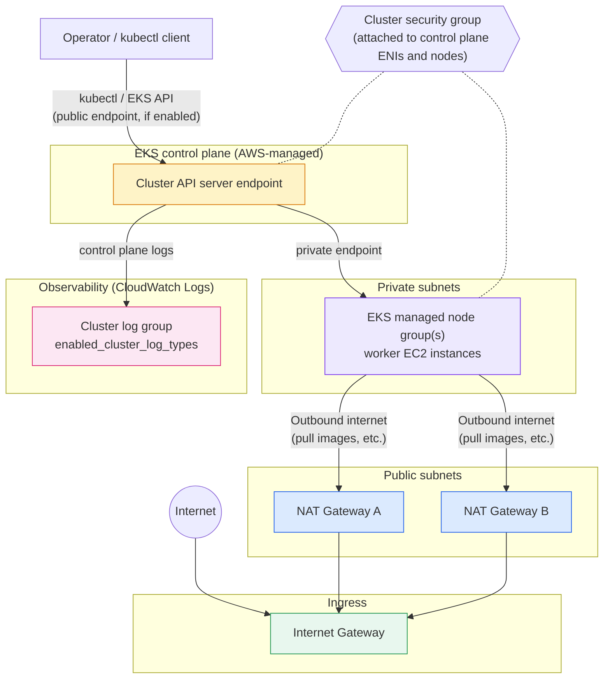
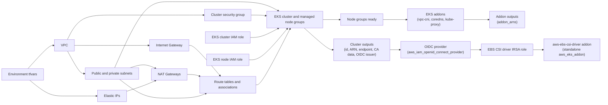

# EKS Standards

This implementation builds a VPC with public and private subnets, NAT gateways,
and a standards-compliant EKS cluster with managed node groups. The cluster
control plane runs with configurable private/public API endpoint access, worker
nodes run in the private subnets, and control-plane logs are delivered to
CloudWatch Logs.

## Runtime traffic flow



The cluster's API endpoint access is controlled by `endpoint_private_access`,
`endpoint_public_access`, and `public_access_cidrs`. When the public endpoint is
disabled, `kubectl` must reach the API server from inside the VPC or a connected
network.

## Terraform dependency flow



Terraform uses the base modules under `modules/base/` for each component. The
EKS control plane, node groups, and most addons are provisioned together by
`modules/base/eks`, which depends on the private subnets and route table
associations being in place before nodes can reach the NAT gateways for
outbound access. Addons are applied after the managed node groups so that
they have nodes to schedule onto; configure them via the `eks_addons`
variable. The `dev` environment enables the VPC CNI's `enableNetworkPolicy`
setting via `configuration_values`, so Kubernetes `NetworkPolicy` resources
are enforced by the CNI itself.

The `aws-ebs-csi-driver` addon is **not** part of `eks_addons` — it needs an
IRSA (IAM Roles for Service Accounts) role scoped to its Kubernetes service
account, and that role's trust policy needs the cluster's OIDC issuer URL,
which only exists after the cluster itself is created. Passing that role's
ARN through `module.local_eks`'s own `addons` input would create a dependency
cycle (the module would depend on a resource that depends on the module's own
output). Instead, `main.tf` creates the OIDC provider
(`aws_iam_openid_connect_provider.eks`), the IRSA role
(`module.local_ebs_csi_driver_role`), and a standalone `aws_eks_addon.ebs_csi_driver`
resource after the cluster and node groups exist.

## Operator quick reference

```bash
aws sts get-caller-identity
aws configure get region

aws eks update-kubeconfig --region us-east-1 --name <EKS_NAME>

kubectl config current-context
kubectl cluster-info
kubectl get nodes
kubectl get ns
```
