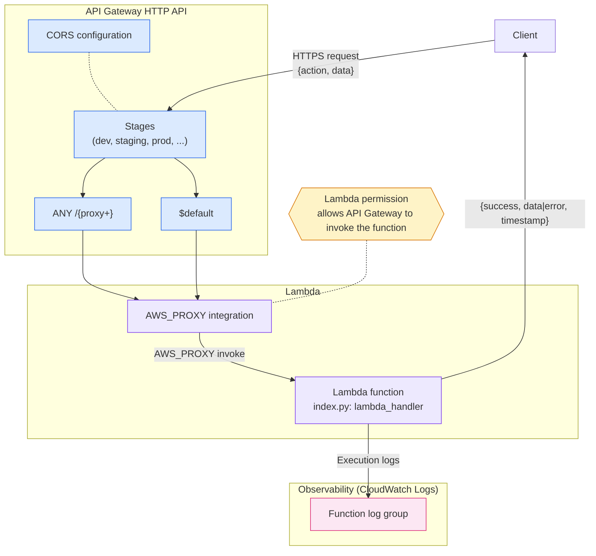
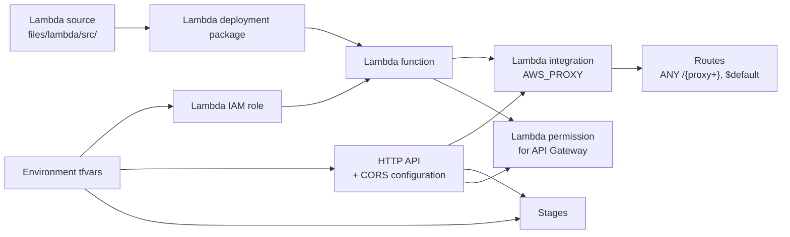

# Lambda HTTP API Architecture

This implementation builds an API Gateway HTTP API in front of a single Lambda
function, using an envelope pattern for request and response bodies. The
function is invoked through an AWS_PROXY integration for every route and stage,
and its execution role is scoped to CloudWatch Logs only.

## Runtime traffic flow

Every route resolves to the same Lambda integration, so routing logic lives in
the function's `action` dispatch rather than in API Gateway. The `aws_lambda_permission`
resource is what actually authorizes API Gateway to invoke the function; without
it, requests fail with an authorization error even though the integration and
routes exist.

## Terraform dependency flow

Terraform uses the base modules under `modules/base/` for the IAM role and the
Lambda function itself; the API Gateway resources are defined directly in this
implementation since no reusable HTTP API base module exists yet. Changing
`files/lambda/src/index.py` and reapplying rebuilds and redeploys the function's
package.
