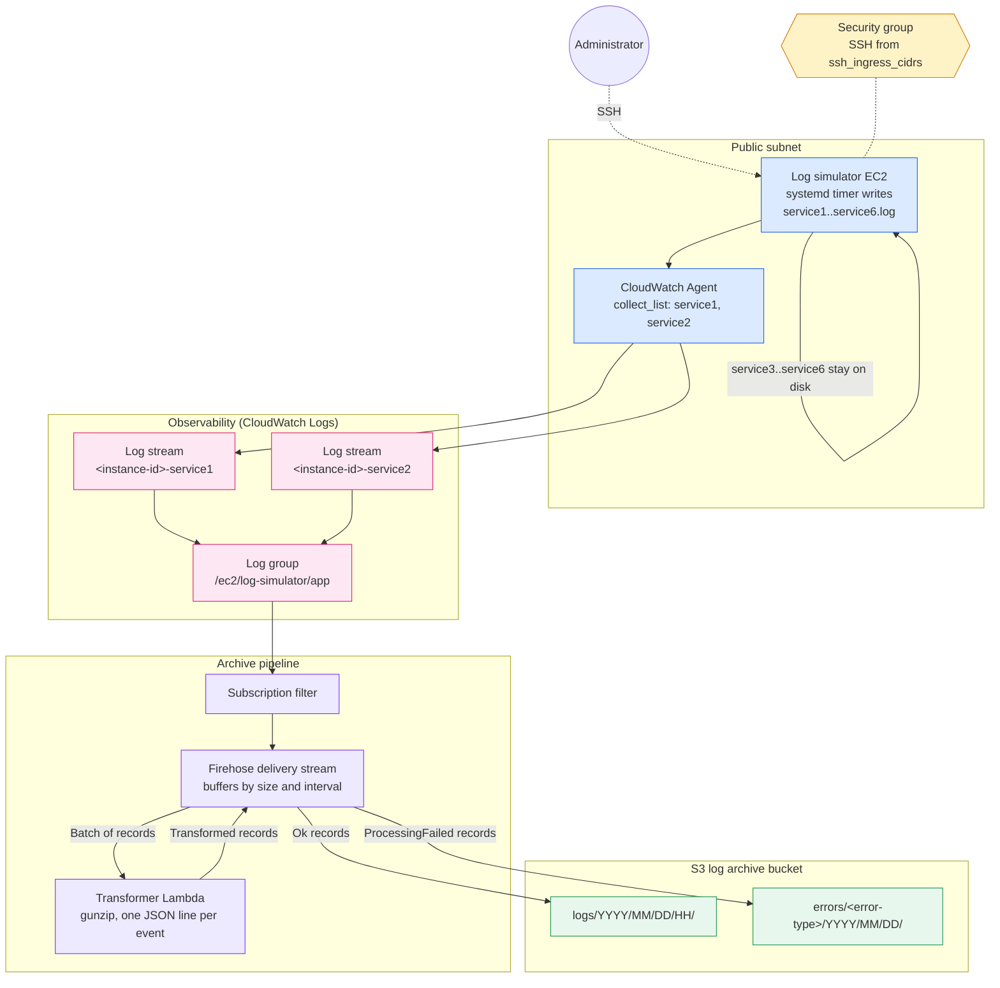
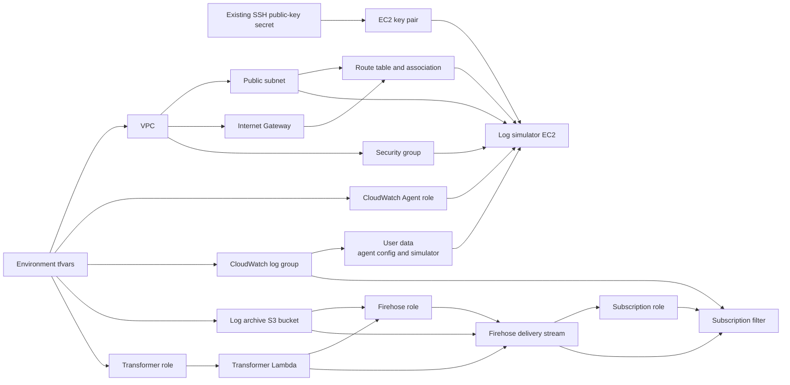

# Log Simulator EC2 with CloudWatch Logs and S3 Archive

This implementation builds a VPC with a public subnet, a single log-simulator EC2
instance, and one CloudWatch log group. The instance simulates six services that
each write their own log file, but the CloudWatch Agent ships only two of them.
Events in the log group are then streamed through Firehose, reshaped by a Lambda
transformer, and archived to S3.

## Runtime log flow

Only the files in `collected_log_paths` (default `service1.log` and
`service2.log`) are listed in the agent's `collect_list`. The other files under
`/var/log/app/` still fill up on disk, but nothing ships them off the instance.
`collected_log_paths` must be a subset of `simulated_log_paths`. The instance
role has only `CloudWatchAgentServerPolicy`, because the collected/uncollected
split is made in the agent configuration, not in IAM.

The subscription filter covers every stream in the log group and forwards events
that match `log_subscription_filter_pattern`. Firehose invokes the Lambda once
per buffered batch (`log_archive_buffer_size_mb` or
`log_archive_buffer_interval_seconds`, whichever is reached first), not once
per event. S3 prefixes use Firehose arrival time, and the bucket expires objects
after `log_archive_expiration_days`.

## Terraform dependency flow

Terraform uses the base modules under `modules/base/` for each component. The
Secrets Manager secret named by `ssh_public_key_secret_name` must already exist
and hold a single OpenSSH public key, which Terraform registers as the key pair
named by `key_pair_name`. Do not store a private key in it.

Standard EC2 user data runs only on first boot. Changing `simulated_log_paths`,
`collected_log_paths`, or the CloudWatch Agent bootstrap later does not
reconfigure an existing instance unless you apply the change on the instance or
accept replacement.

To check delivery after an apply, SSH to the instance (`ssh_command` output) and
confirm `simulate-services.timer` is active and all six files under
`/var/log/app/` are growing. The log group (`log_group_name` output) should
contain exactly two streams, `<instance-id>-service1` and
`<instance-id>-service2`, and objects should appear under `logs/` in the bucket
(`log_archive_bucket_name` output) after the buffer interval.
