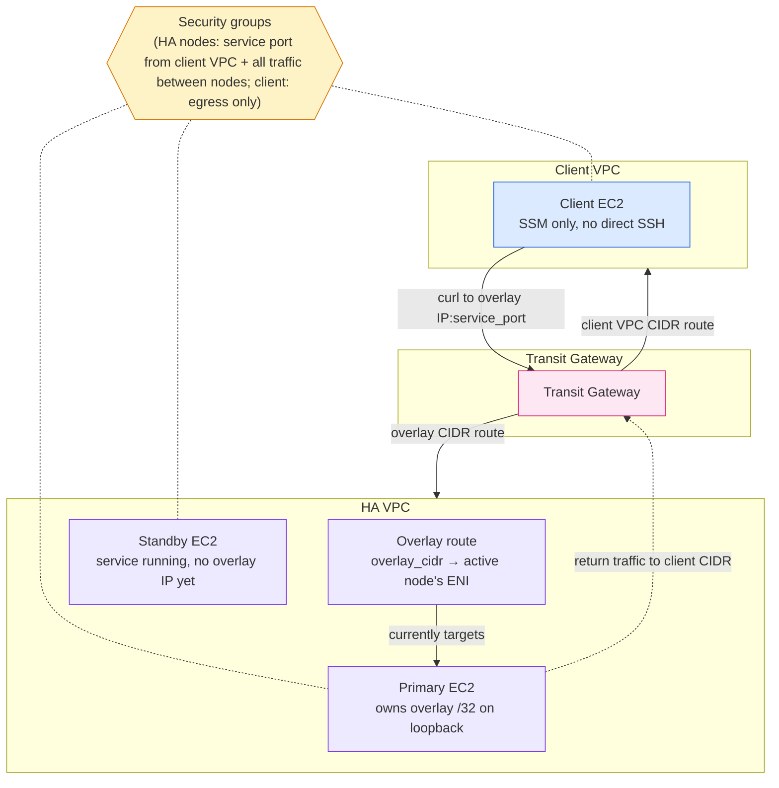
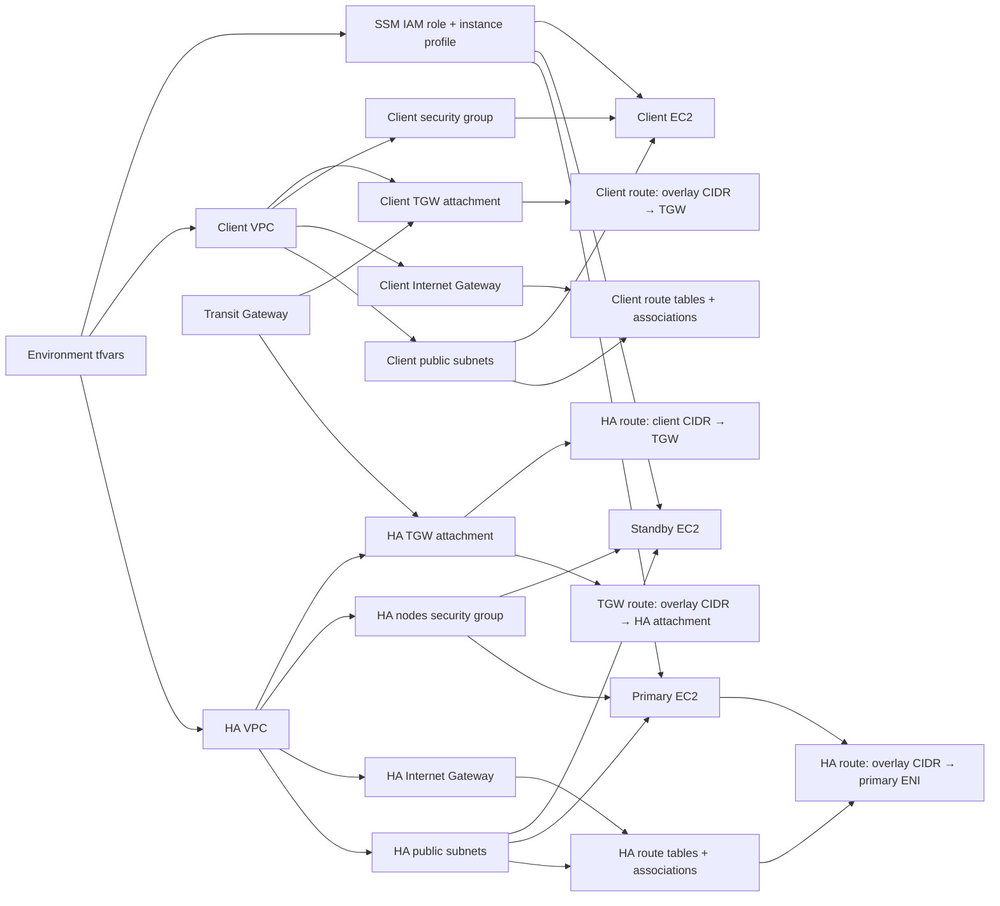

# Networking Overlay IP Architecture

This implementation builds a two-VPC overlay-IP test topology: an HA VPC with a
primary and standby node, and a client VPC with a test instance that reaches the
overlay address through a transit gateway. It models the route a tool like
Pacemaker would repoint during a SAP-style HA failover, without any clustering
software — the failover itself is done manually.

## Runtime traffic flow

All three instances share one IAM role and instance profile so Systems Manager
is the only way in — there's no bastion or open SSH. Failover is manual: moving
traffic to the standby means adding the overlay `/32` to its loopback, replacing
the HA VPC route's ENI target, and removing the address from the primary (see
`manual_failover_commands` in the outputs).

## Terraform dependency flow

Terraform uses the base modules under `modules/base/` for VPCs, subnets,
internet gateways, route tables and associations, security groups, EC2
instances, the IAM role, the transit gateway, and its VPC attachments. Three
resources stay in this implementation rather than a base module because their
targets (an ENI, a transit-gateway attachment) are specific to this
composition: the overlay route to the active node, the client-side route to the
overlay CIDR via the transit gateway, and the HA-side return route to the
client VPC CIDR.
