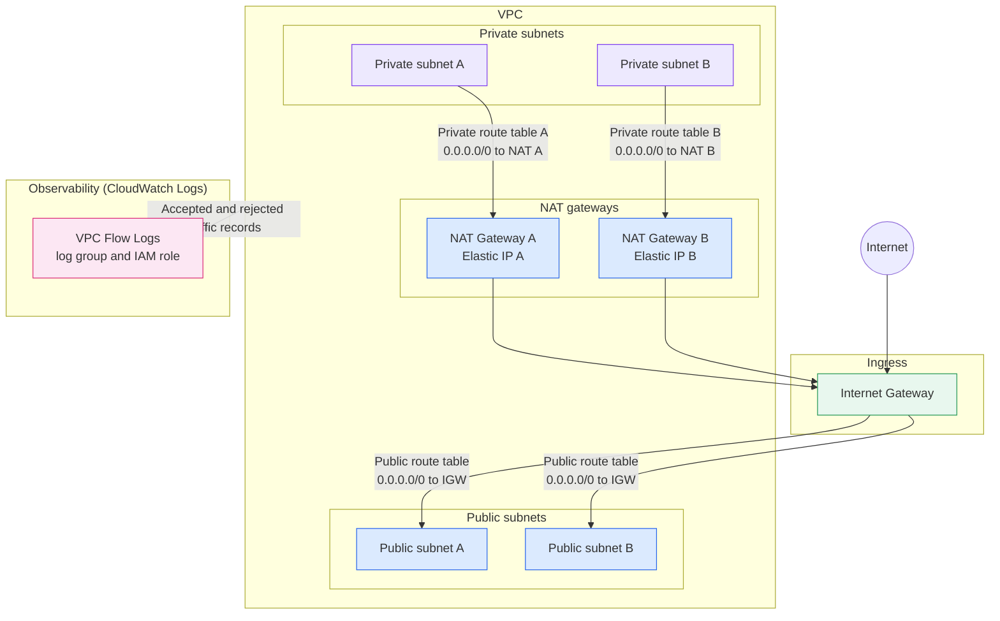
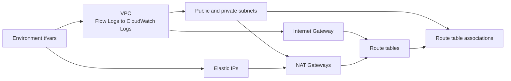

# VPC Standards Architecture

This implementation builds a VPC with public and private subnets, an Internet
Gateway, Elastic IPs and NAT gateways, and route tables with their subnet
associations. VPC Flow Logs are enabled and delivered to CloudWatch Logs. It
creates no compute, so it serves as the network foundation for other
implementations.

## Runtime traffic flow

Which subnet hosts each NAT gateway is set by `subnet_name` in `nat_gateways`,
and Terraform looks that name up in the `private_subnets` map. A NAT gateway
needs a subnet routed to the Internet Gateway to reach the internet, so check
that the configured names and the route table associations agree. The diagram
shows the intended layout of NAT gateways in public subnets. The route tables and
associations come from `public_route_tables`, `private_route_tables`,
`public_rtb_assoc`, and `private_rtb_assoc`.

## Terraform dependency flow

Terraform uses the base modules under `modules/base/` for each component. The
NAT gateway route targets are built from the created gateways by name, so a
private route table refers to a NAT gateway through the `nat_gateways` entry
names. The module exposes `vpc_id`, `vpc_cidr_block`, `public_subnet_names`, and
`private_subnet_names` as outputs for other implementations to consume.
